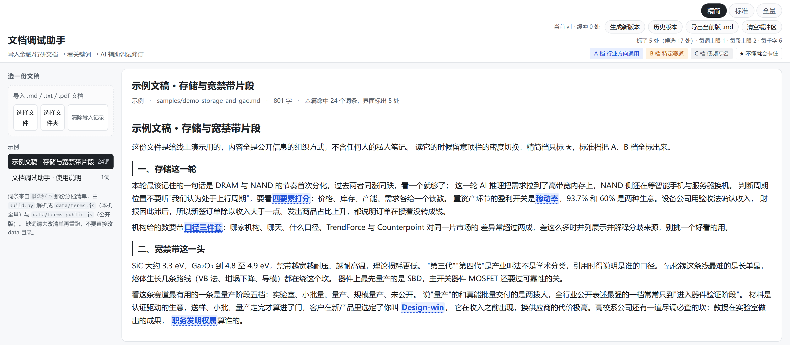

# 文档调试助手

原名「概念透视」。现在做的一件事：把你手上的一份文稿弄进来读通、改顺。

导入 `.md` / `.txt` / `.pdf` 之后，正文里每个专业词按《概念账本》就地标出档位，点开设义；
选中一段可以直接问 AI，也可以给它一个方向让它改写。改写稿会自动匹配它要替换的那个段落的
格式（标题、列表符号、句末标点），确认后先进编辑缓冲区，攒几处再一键生成新版本，
历史版本能回退，最后导出 Markdown。

在线试用 <https://mofan-mofan.github.io/concept-lens/>，读的是仓库自带的示例文稿和公开版词条。
本地用就 clone 下来双击 `index.html`，零安装；只有解 PDF 和问 AI 这两处要联网。

## 界面上

左边选文稿，或者导入自己的文件。中间是正文。右边是词条卡：释义、词频、让它现给一段白话解释、
复制「拿这个词去问 AI」的话术。顶栏切标注密度（精简／标准／全量）和版本。

## 想改的话

- 加词、改释义 → 改账本那份分档清单，重跑 `python build.py`。手改 `data/` 里生成的文件会被覆盖。
- 标注太疏或太密 → `js/config.js` 的 `levels`。同形词误标 → `hand/guards.js`。
- 改写稿的格式怎么规整 → `js/format.js`。版本与缓冲区 → `js/version.js`，两者都只写 localStorage。
- 问 AI 用哪个模型、提示词怎么写 → `js/config.js` 的 `ai`。API Key 填在界面上，只存本机浏览器。
  发给接口的只有你选中的那一段（上限 4000 字，`maxQuoteChars` 可调）加本轮对话，整篇文稿不出去；
  导入的文稿、编辑缓冲区和历史版本也都只在本机 localStorage 里。
- 改完回浏览器 Ctrl+F5，不然还在跑旧数据。

`build.py` 一次写出两份词条：`data/terms.js`（本机全量）和 `data/terms.public.js`（随仓库发布的版本）。

## 公开了什么

公开的是标注引擎、导入、AI 问答与改写、版本管理、可调参数、护栏，一份 298 条的公开版词条库，
外加两份示例文稿：`samples/demo-storage-and-gao.md` 是给演示写的短文，全是行业词，
首屏打开的就是它；另一份是本说明。

不公开的有四样：我本机的 24 篇文稿全文、全量词条、词条补录源、以及带原句的命中体检报告。
前三样装着私人笔记的定位信息，最后一样是别人的资料，都在 `.gitignore` 里。
公开版词条是把这些字段抹掉、再把释义里少数几句只对我自己有意义的话改写一遍之后的产物；
那份改写对照表也住在本机文件 `corpus.local.py` 里 —— 写进公开的 `build.py` 就等于把
「我藏了哪家公司、改了哪座城市」摊在明面上。

所以线上永远只有示例文稿，这是设计如此。想标自己的文稿，本地双击打开就行。

## 边界

只标注账本里已登记的词，不自动发现新词。读到一个没标又看不懂的词，是账本缺条目，
照 `hand/terms_extra.sample.js` 补一行重跑。词频与分档只在这 24 篇语料上成立，
换一批不相干领域的文档，护栏要重配。格式规整只做确定性的整理，拿不准的不动，只在提示里说明。

## License

MIT。
